# Domain Positive Label XRAY Images

# DATASET LABELS
---

## 1. Enlarged Cardiomediastinum

---

## 2. Cardiomegaly

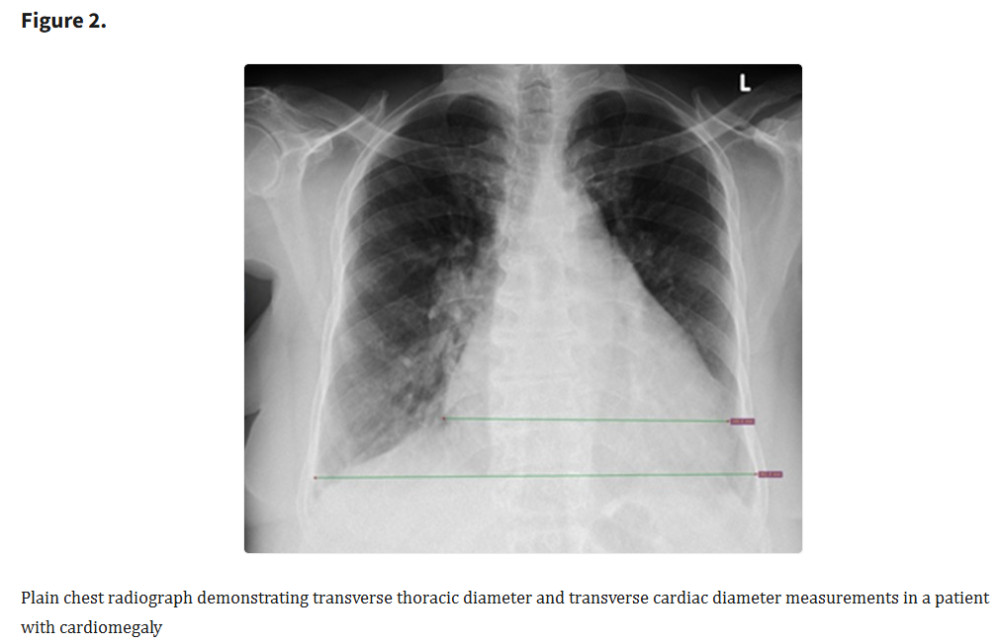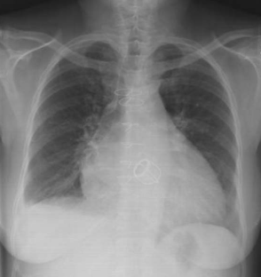 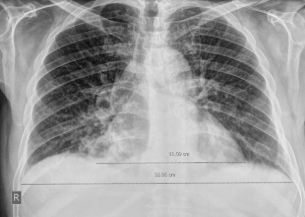
---

## 3. Lung Opacity

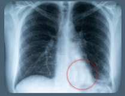 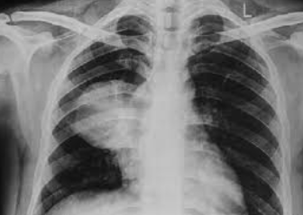
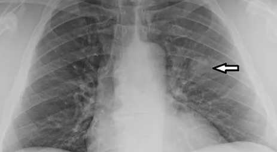
---

## 4. Lung Lesion

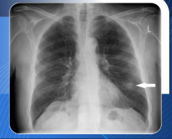 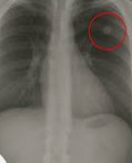
---

## 5. Edema
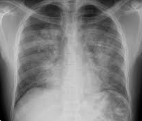 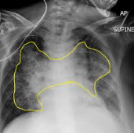 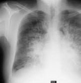

---

## 6. Consolidation
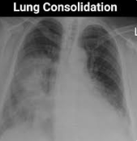  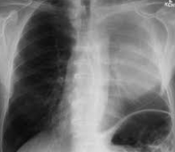
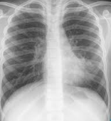
---

## 7. Pneumonia
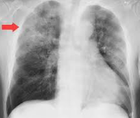 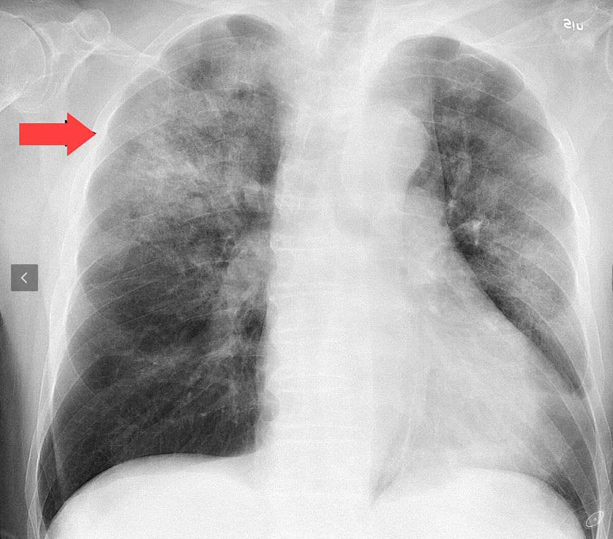 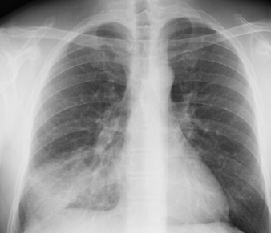
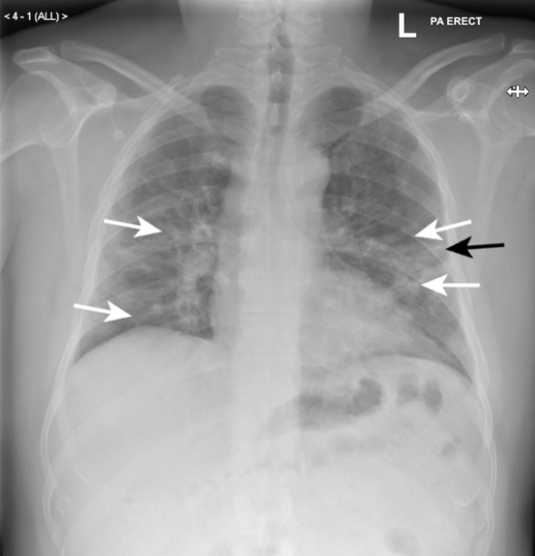
---

## 8. Atelectasis

---

## 9. Pneumothorax

---

## 10. Pleural Effusion

---

## 11. Pleural Other

---

## 12. Fracture

---

## 13. No Finding

---

## 14. Support Devices

---

